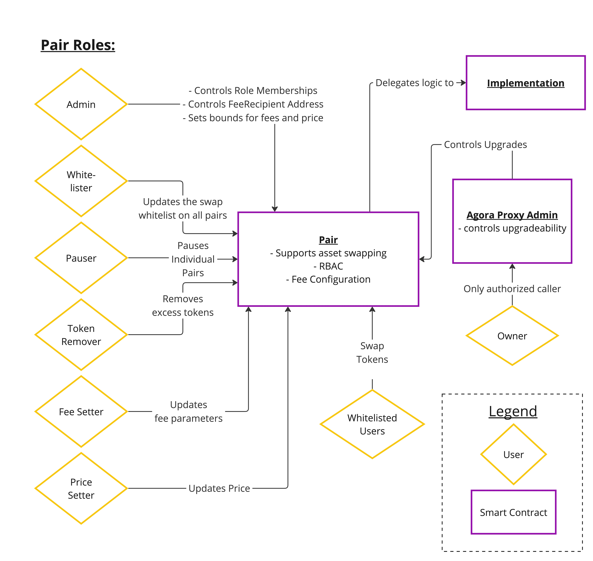
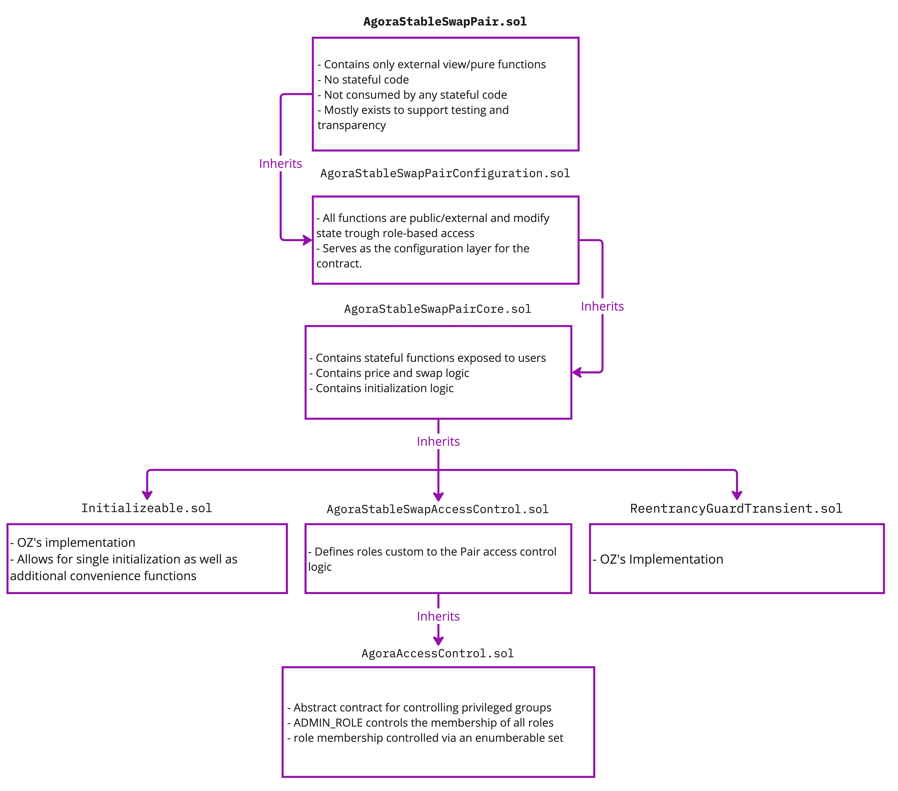

### Installation
`npm i`

### High level Organization of files

`src/contracts` This directory contains all contracts for deployments

`src/contracts/interfaces` This directory contains all interfaces required to compile

### Ecosystem Participants

### Key Contracts and their inheritance
